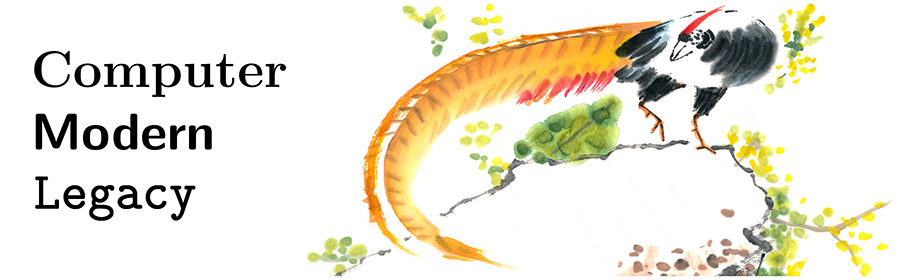

Computer Modern Legacy - An OpenType Computer Modern font family

**Can I already use it?**

No, not yet, it is still under development.

**Where will I be able to use it?**

Anywhere where you can use [OpenType](https://en.wikipedia.org/wiki/OpenType)
fonts today, which is close to everywhere:
websites, documents, books, posters, mobile apps, LuaLaTeX, Word, and so on …

**What is it and why would I want to use it?**

It is a font family tailored to look as identical as possible to
[Donald E. Knuth](https://en.wikipedia.org/wiki/Donald_Knuth)’s
[**Computer Modern**](https://en.wikipedia.org/wiki/Computer_Modern)
font family, which he designed and implemented using different technology,
namely [METAFONT](https://en.wikipedia.org/wiki/Metafont)
and [TeX](https://en.wikipedia.org/wiki/TeX), where close to identical means
both in terms of glyphs (character shapes) and metrics (glyph positioning).

The fonts in the family are of very high quality and beauty,
in my personal view even today often unparalleled by expensive commercial fonts.

Pragmatically, these fonts could also help migrate existing
TeX/[LaTeX](https://en.wikipedia.org/wiki/LaTeX) documents based on METAFONT or
[Type 1 (Adobe/“Postscript”) fonts](https://en.wikipedia.org/wiki/PostScript_fonts)
to new TeX/LaTeX variants that are mainly tailored for OpenType fonts,
namely LuaLaTeX and XeLaTeX.
Specifically with LuaLaTeX, it will presumably be easy to create
tagged/accessible PDFs, documents that will be accessible also to persons
who cannot see or not see well, and providing such documents seems
to become a legal necessity in more and more contexts (see, for example,
the [European accessibility act](https://commission.europa.eu/strategy-and-policy/policies/justice-and-fundamental-rights/disability/union-equality-strategy-rights-persons-disabilities-2021-2030/european-accessibility-act_en)).

But even outside of TeX/LaTeX, if you design things carefully,
you can get high quality output today, including on webpages,
with properly justified, hyphenated and weightened text using CSS.
And, if you are not that careful, you will often still get unique visual quality.

**Isn’t Computer Modern already the default in LuaLaTeX and XeLaTeX?**

Not exactly. The default is **Latin Modern** in its OpenType variant,
a font that is very similar to Computer Modern but differs in many details,
both in terms of glyphs and metrics.
Some changes were made in order to support additional languages,
while others for maybe other reasons.

The details and history of fonts that look similar to Computer Modern
seems rather complex and convoluted, with the main driver for differences
apparently having been the ability to support additional languages beyond
what Computer Modern with METAFONT and the original TeX engine could support.

The Computer Modern Legacy font family here, in turn, aims to port the original
look and feel to OpenType including in LuaLaTeX and XeLaTeX, but it will only
cover support for the languages that can be supported with Computer Modern
in pdflatex today, which are actually already quite a few languages that use the
Latin alphabet, for example, you can use a letter ‘a’ with a breve “halfmoon”
accent ‘ă’ as used in Romanian and Vietnamese.

If you are interested in details regarding fonts similar to Computer Modern,
maybe this
[tex.stackexchange.com question](https://tex.stackexchange.com/questions/757140/evolution-of-computer-modern-or-who-lowered-the-dot-on-the-i)
of mine could be an interesting first stop.

**Will math also be supported?**

Math support is not planned so far and I know way too little about what it
would entail at the moment.

In a nutshell, only maybe if it could be done without a huge detailed effort,
but I am also not sure so far if there is a similar need/incentive
to preserve the legacy regarding math.

But never say never.

**How much will it cost?**

Nothing at all, as almost everything around TeX.

Most likely it will be released under the
[SIL Open Font License](https://openfontlicense.org)
with reserved font name ‘Computer Modern Legacy’,
which means in a nutshell that you will be able to use the font
wherever you want without even explicitly having to credit its usage,
and you will be able to create and publish derived fonts—if and only if
you choose a different font name.

**Will there be a LaTeX package?**

Most likely yes.

Even though OpenType fonts can easily be used from LaTeX,
doing it in a way that reproduces the original look and feel
out-of-the-box requires to do a number of settings,
like telling TeX which font file to use for which font size, for example.

**Who are you and why are you doing this?**

I am a Swiss physicist (*1966 in Zürich)
and as a hobby I am mainly doing fundamental research
that I also publish in often quite dense forms on my website
[**exactphilosophy.net**](https://www.exactphilosophy.net).

*If you want to do me a huge favor, visit the site and give its ideas
a chance.* They are much more sophisticated and thought through than a
superficial look might suggest. The core idea is a different approach
to describing the individual experience of life, in a way that resembles
what especially ancient Greek philosophers did in their time, but taking
all kinds of newer findings into account.

I started to create this font family because it feels like something
worth and beautiful to do, for humanity and also a bit for me as a
longtime LaTeX user; my website is largely based on Computer Modern Sans,
and I do consider the triunity TeX/METAFONT/Computer Modern in many ways
technology (TeXnology?) superior to what is usually produced today,
and also a piece of art …

[alain@exactphilosophy.net](mailto:alain@exactphilosophy.net)
